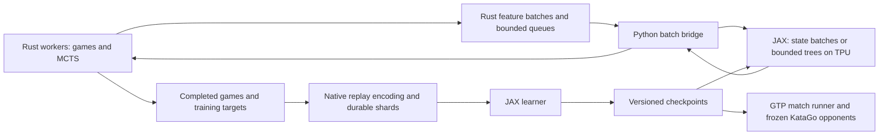

This design was prepared on 2026-09-11. Immutable source/native builds, Rust rules/MCTS/persistent actors, and cloneable plain-JAX learners run on all configured hosts and the configured TPU devices. Scoring compatibility and exact CPU/TPU continuation are qualified. The first ownership component pilot ran two 4.19M-move arms; its external panel had 11 losses and five move-limit games, so it does not establish a strength improvement. Baseline tuning, modern algorithmic comparisons, transfer and sustained production training remain implementation milestones. See [current status](ops/STATUS.md), the [ownership report](research/studies/ownership_aux/README.md), and the [scoring report](research/studies/scoring_compatibility/README.md). Settings below remain proposals unless tied to an executed result or cited source.

The objective is to produce a strong Go engine trained from scratch, and demonstrate an improvement in playing strength for a fixed total compute budget over a carefully tuned AlphaZero-style baseline. Rust owns authoritative rules, CPU search, actors, and replay; Python, managed with `uv`, dispatches plain-JAX model execution and training. Bounded multi-step executables may mirror exact rules on the TPU or propose action trees for bulk Rust materialization and neural verification. KataGo supplies external evaluation opponents. Its weights, policy labels, and games do not enter the default training lineage. A future teacher-assisted run would be a separately identified experiment.

The user's multi-step execution proposal and minimal-dependency model requirement are developed in [MULTISTEP_SEARCH.md](MULTISTEP_SEARCH.md). The initial protocol generates two sets of `k` autoregressive traces, each `2N` plies long, in one executable and resolves continuations on the CPU. Separate play and opponent-behavior policy heads learn MCTS-improved decisions and observed opponent actions respectively. That document specifies reconciliation, sampling invariants, exact versus learned transitions, functional JAX modules, and throughput experiments. Multi-step execution is an early research track, before the broad architecture sweep.

Success has three independently reported dimensions: rules correctness and engine performance; learning efficiency against an internal control; and absolute strength against pinned external engines. Reaching a particular human rank cannot be inferred from a few engine matches. Matching the strongest contemporary KataGo is a stretch objective whose feasibility depends on allocation duration and measured learning curves.

The workspace began without application code. Read-only SSH inventory succeeded on all four provided hosts. This table reports host memory, not accelerator memory; disk space is a changing snapshot of the filesystem containing the home directory.

| Host suffix | Logical CPUs available to the process | RAM | Free disk | System packages observed |
|---|---:|---:|---:|---|
| `worker-0` | 240 | about 400.5 GiB | about 49.4 GiB | JAX 0.2.17, jaxlib 0.1.69 |
| `worker-1` | 240 | about 400.5 GiB | about 31.5 GiB | JAX 0.2.17, jaxlib 0.1.69 |
| `worker-2` | 240 | about 400.5 GiB | about 45.2 GiB | JAX 0.2.17, jaxlib 0.1.69 |
| `worker-3` | 240 | about 400.5 GiB | about 44.9 GiB | JAX 0.2.17, jaxlib 0.1.69 |

This table is the initial inventory; its old system JAX versions are not used by our runs. Workspace-isolated environments now use Python 3.12.13, JAX/jaxlib 0.11.1, and libtpu 0.0.46.1 on every host. Rust 1.98.1 and a locally compiled, pinned KataGo 1.18.1 Eigen/AVX2 engine are available on host 0. Distributed initialization, native deployment, real self-play updates and complete checkpoint continuation passed. Independent job/role grouping, durable storage and production recovery remain qualification work.

A standard **TPU means 16 chips / 32 TensorCores**, normally four hosts with four chips each. At 32 GiB per chip, that implies 512 GiB aggregate HBM. Multiple hosts do not establish that this is a Multislice allocation. We will inspect the actual resource and device topology before configuring meshes or independent jobs. The plan budgets for 16 chips until that is verified. [Google TPU specifications](https://docs.cloud.google.com/tpu/docs/v4), [Multislice overview](https://docs.cloud.google.com/tpu/docs/multislice-introduction).

There are four reference families to reconstruct, plus a contemporary architecture control. They are evidence to test in our regime, rather than one universally agreed recipe.

| Reference | Verified choices or findings | Consequence for our experiments |
|---|---|---|
| AlphaZero, Science 2018 | 800 simulations/move; batch 4,096; Go Dirichlet alpha 0.03. Its Go learning-rate schedule drops the nominal 0.2 rate to 0.02 at step zero. It omits Go symmetry augmentation and the older AlphaGo Zero promotion gate. | Keep an explicitly named reduced AlphaZero control. Record changes in model size, rules, and heads; do not describe it as an exact reproduction of the original run. |
| Leela Zero | Public training code uses momentum 0.9, Nesterov updates, L2 scale `1e-4`, and weight averaging. Its code explicitly distinguishes a suggested self-play learning rate from the hardcoded default. | Compare optimizer and averaging choices, tied to a particular code revision. Avoid treating one source-file default as the recipe for every historical run. |
| KataGo 2019 | Full-search probability 0.25; initial full/fast caps 600/100, later 1,000/200; only full-search turns become training rows. The paper studies forced playouts plus policy-target pruning, global pooling, and auxiliary targets. | Establish a practical Go baseline using these mechanisms and then remove them in controlled ablations. |
| Andy Jones, 2021 | Experiments concern Hex. They use regularized search, an exploration coefficient around 1/16, batches around 32k, a 2M-row buffer, and accelerator-resident simulation. | Test exploration, replay age, batch size, and compute allocation jointly. The reported coefficient is not directly interchangeable with a differently scaled PUCT implementation. |
| KataGo 2026 | Released models include attention trunks with nested bottlenecks, RMSNorm, learned 2D RoPE, and SwiGLU. Transformer training also uses Muon. | Include this as a modern control; introducing attention or Muon alone is not a novelty claim. |

Sources for those rows: [AlphaZero paper and methods](https://storage.googleapis.com/deepmind-media/DeepMind.com/Blog/alphazero-shedding-new-light-on-chess-shogi-and-go/alphazero_preprint.pdf), [Leela Zero training implementation](https://github.com/leela-zero/leela-zero/blob/next/training/tf/tfprocess.py), [KataGo paper](https://arxiv.org/abs/1902.10565), [Jones paper](https://arxiv.org/abs/2104.03113), [KataGo architecture documentation](https://github.com/lightvector/KataGo/blob/master/docs/NetworkArchitectures.md), [KataGo's July 2026 network study](https://lightvector.github.io/katagostudies/202607-symmetry/). David Wu's [Jane Street article](https://blog.janestreet.com/accelerating-self-play-learning-in-go/) directly identifies his KataGo paper, making it the likely Jane Street reference; Jones remains a separate comparison.

A further research candidate is [Regret-Guided Search Control, ICLR 2026](https://rlg.iis.sinica.edu.tw/papers/rgsc/): prioritize self-play starting states using predicted value/outcome discrepancy. Its authors report gains in their own settings, which are not directly comparable to our current checkpoint or budgets. A local test must preserve complete Go move/superko history when restarting from selected states, distinguish state selection from replay weighting, and count selection-network and reanalysis costs. It is a proposed curriculum experiment, not an implemented result.

The implementation has the following boundaries. Cloning/source integrity, the pod executor, GTP transport, the runtime probe, and initial Rust rules/GTP crates exist. The remaining components below are planned. Research owns cloneable scientific recipes, while the root infrastructure serves production and common validation.

| Component | Ownership | Proposed location |
|---|---|---|
| Rules engine | Board state, chains, liberties, captures, history, legality, scoring, SGF | `crates/go-core` |
| Search engine | PUCT, Gumbel, tree arenas, backup, visit accounting, targets | `crates/go-search` |
| Actor system | Worker scheduling, feature encoding, inference queues, replay encoding | `crates/go-actors` |
| Python binding | Coarse batch buffers and completions; PyO3/maturin packaging | `crates/go-bridge` |
| Playable engine | GTP, clocks, model-service connection, analysis output | `crates/go-gtp` |
| Research learning recipes | Complete plain-JAX model, losses, optimizer, and training loop; cloneable per experiment | `research/recipes/<id>` |
| Production learning recipes | Promoted and validated official training implementations | `production/recipes/<id>` |
| Shared Python library | Low-level math, runtime, formats, bindings, source/run provenance, evaluation interfaces | `packages/gozero` |
| Multi-step execution | Recipe-owned decoders; shared packet transport and Rust prefix/search handling | Recipe helpers, `packages/gozero`, `crates/go-search` |
| Experiment system | Immutable specifications, seed/budget plans, evaluation, analysis, launch manifests | `research/studies`, `eval`, `ops` |

Every experiment captures the selected recipe together with shared/production/native source, resolved configuration, dependency locks, and external artifact identities. A recipe-only copy would not isolate it from later library changes. Source snapshots are content-addressed; experiment specifications and execution attempts have separate identities. The implemented executor runs trainers from their frozen bundle. Cloning copies the full scientific training code, following the supplied rig style. Promotion copies a validated recipe into production with its provenance; sustained training does not import a changing research directory. See [research/README.md](research/README.md).

The rules engine accepts board size at runtime, with checked allocation and indexing limits rather than a built-in 19x19 maximum. Common sizes receive optimized storage paths only if profiling justifies them; a generic path remains authoritative. Initial training buckets are 5, 7, 9, 13, and 19. Larger sizes such as 25 and 37 exercise the generic implementation, without implying that an untrained model will play them well. Square boards are the initial public contract.

The first rules profile is strict Tromp–Taylor area scoring: positional superko, suicide handled according to that ruleset, pass exempt from repetition rejection, two consecutive passes ending the game, and explicit komi. Scoring uses the actual terminal board and flood-filled empty regions. It does not silently remove stones judged dead by a neural network. Exact komi values are part of each experiment, with 7.5 the starting 19x19 setting. Smaller-board komi is calibrated separately. Additional Chinese, Japanese, territory-scoring, handicap, and adjudication profiles come after the first complete training loop. [Tromp–Taylor rules](https://tromp.github.io/go.html).

Observed qualification amendment: KataGo 1.18.1's area scorer first marks pass-alive territory, which can include remaining opposing stones, even with `rules=tromp-taylor` and `friendlyPassOk=false`. Its terminal `final_score` therefore is not always the raw final-board score used here. Three of four bootstrap games had different margins, while all four winners agreed. The harness retains both scores and independently verifies the native raw score. A winner disagreement fails compatibility qualification. Matched adjudication profiles and dedicated fixtures are required before a strength-promotion claim; the earlier 73-ply agreement was a single successful case, not proof that the profiles are identical. See [evaluation details](eval/README.md).

Each game carries the full relevant superko history. The neural observation can use a finite history, but the legality oracle cannot. A 128-bit Zobrist fingerprint accelerates lookup; matching fingerprints trigger exact position comparison. Real-game history and the current simulated path both participate in legality checks. Pass status, side to move, rules, komi, and terminal status are explicit state. A move-limit safeguard yields a logged truncation, excluded from terminal-outcome training, rather than an invented draw or win. The main benchmark also reports truncation frequency.

Use a compact board array with a sentinel border, incremental chain membership, distinct liberty tracking, and a reversible mutation journal. A basic union-find structure alone is insufficient for captures and undo. Search workers maintain scratch boards and undo trails instead of copying an entire board at every node. Benchmark this against small-board copying because the faster choice can depend on board size and search depth. Avoid permanently allocating a board-sized liberty bitset for every possible chain on arbitrarily large boards.

Correctness precedes optimization: an independent simple reference implementation, curated ko/superko/suicide/seki/pass/capture fixtures, randomized differential tests, deep apply/undo sequences, symmetry checks, and SGF round trips. For small sampled states, compare the entire legal-action set. Before training beyond smoke tests, require at least one million checked transitions across the size suite with no unresolved divergence. Also compare positions and results against a pinned KataGo build with explicitly matched rules, auditing any pass-alive or scoring shortcuts rather than treating a ruleset name as sufficient equivalence.

For search, v0 uses many independent games and worker-owned trees. One worker owns all mutable statistics for a tree. It multiplexes several games so that, while one awaits neural evaluation, it can advance another. Start with one unresolved leaf per tree: this avoids virtual-loss distortion while obtaining large accelerator batches across games. Later, a small number of unresolved leaves per tree is a separate systems/search ablation; visits, reservations, and completed evaluations must remain distinct.

Tree nodes and edges live in reusable arenas, addressed by compact indices. Pack the data used during child selection together; separate cold annotations and exported diagnostics. Compare array-of-structs and structure-of-arrays layouts on realistic trees rather than assuming either wins. Keep subtree reuse within a model version. Disable graph-style transposition merging initially because visually identical boards can have different superko histories. An inference cache may store raw outputs keyed by model version and the complete encoded input; legality masking is applied for the actual state after retrieval.

The CPU scheduling policy is designed specifically for cache behavior. Allocate and first-touch worker arenas and staging buffers in the intended NUMA domain. Pin long-lived workers after measuring socket and core topology. Reserve cores for JAX dispatch, transfer handling, storage, and the coordinator. Prefer moving new games over migrating live trees. Queue producer/consumer indices and per-worker counters occupy separate cache lines; workers aggregate metrics locally before occasional export. Avoid a global visit counter, a shared heap allocation per expansion, and a contended queue for every leaf. Use batched bounded queues and memory ownership to reduce synchronization; introduce unsafe code only where measurements justify a narrow, tested implementation.

The initial worker sweep uses 1, 2, 4, 8, 16, 32, 64, and up to the measured physical-core count, followed by an SMT comparison. Independently sweep 4/16/64 live games per worker and inference batch size, subject to a per-host tree-memory cap. Collect cycles/expansion, instructions/cycle, branch misses, cache misses, allocations, memory bandwidth, context switches, migrations, remote NUMA traffic, and cache-line contention where host counters permit. Include representative opening, capturing, ko-heavy, and late-game positions. Evaluate scaling by completed useful work, including a real-network run: extra CPU activity caused by spin-waiting is not progress.

Python receives contiguous state/feature batches and returns contiguous result packets. Rust owns the authoritative game loop and baseline selection, expansion, backup, legal masks, feature generation, and result routing. The multi-step experiment can compile bounded state advancement and tree computation onto the TPU; it introduces no interpreted Python rollout loop. There are no Python objects for individual search nodes or per-move Python environment calls. The binding releases the GIL during native work and queue waits. Begin with an in-process native actor pool to avoid an unnecessary IPC layer; isolate the actor into a process with shared-memory transport later only if reliability or profiling calls for it.

Use double-buffered host staging, homogeneous board-size/model-version queues, fixed batch buckets, and a maximum wait time before padding a partial batch. Sweep batches such as 32, 64, 128, 256, and 512 per inference replica. Padding rows produce no game moves or training data. Device transfers are explicit costs; a NumPy view across the binding does not make TPU transfers zero-copy. The Rust batcher services games fairly so slow or rare board buckets cannot starve. Measure fill ratio and p50/p95/p99 request latency alongside neural evaluations/sec.

Install a validated Python/JAX/jaxlib/libtpu stack with NumPy and the Rust extension in a project `uv` environment, with `uv.lock`, a pinned Python version, a pinned Rust toolchain, and `Cargo.lock`. Flax, Optax, and Orbax are not runtime requirements. Follow the supplied reference's explicit parameter dictionaries, pure forward/update functions, and explicit compilation/sharding. Keep model primitives, optimizer updates, packet execution, and orchestration in a few inspectable modules. Host manifests also record the runtime image and native build flags. Build the Rust extension once for the qualified hosts and use the same artifact everywhere. Model math is bf16 where validated; master weights, optimizer state where required, losses, softmax reductions, normalization reductions, and search accumulators retain appropriate fp32 precision. [User's plain-JAX reference](https://github.com/honglu2875/rig/blob/main/recipes/reference/train.py), [uv project workflow](https://docs.astral.sh/uv/guides/projects/).

Use stable named PyTrees for parameters, model state, optimizer state, and PRNGs; no framework-managed module state. Compile model application and the complete loss/gradient/update function with explicit sharding, shape buckets, and safe buffer donation. Inference parameters remain separate from donated learner state. Keep metric transfers infrequent and count their synchronization cost. Initially the model and optimizer are replicated, allowing a designated controller to checkpoint arrays with an explicit tree/dtype manifest and completion marker. Checkpoint format and recovery checks cover the full learning state, not only inference weights. General sharded-model persistence is a later capability if model parallelism becomes necessary.

All TPU-owning processes initialize distributed JAX before querying devices or compiling work. Begin with one controller per host and data parallelism over the verified mesh; these model sizes should not initially require tensor parallelism. The first reliable scheduler alternates inference and learner phases on the whole mesh. Every participating controller executes the same ordered operation schedule; padding handles local batch shortages. Actors can prepare later work while the learner runs, subject to bounded queues. Published inference parameters are a separate snapshot from changing learner parameters. [JAX multi-controller requirements](https://docs.jax.dev/en/latest/multi_process.html).

Use `pdsh` over SSH to run the same SPMD entrypoint on all four provided hosts, as in the user's rig workflow. Stage the same source/config snapshot on every rank, verify identities, and supply the declared rank map and rendezvous. Record Python/JAX/libtpu/native build and topology provenance. A failed rank terminates its attempt's process group through the launcher; unrelated jobs are outside its scope. The host map and execution contract are in [ops/README.md](ops/README.md).

After qualification, benchmark disjoint device groups: conceptually three host-local inference groups and one learner group. This is an optimization contingent on supported device/submesh ownership, sufficient inference capacity, and clean restart behavior; it is not assumed to follow merely from having four hostnames. Keep each chip under one runtime owner and collectives within the intended group. Small experiments may use four independent groups when validated. If this is genuinely Multislice, keep latency-sensitive inference local and send replay/checkpoints between roles, measuring the cost of any cross-slice learner synchronization.

Search pins a model version until the current move finishes. A version change between moves clears retained tree statistics. Every training row records its generating version; publication cadence is controlled to bound lag and excessive tree resets. Controlled experiment modes can instead pin a model for a whole game. Track age in learner updates and wall time, as well as policy divergence on a fixed probe set. Merely counting checkpoint versions is insufficient when export frequency changes.

The primary model interface is size-independent: spatial features, board mask, and global inputs including player, komi, and rules. A per-point policy head plus a pooled pass logit yields N²+1 actions. A pooled value head predicts the game outcome. The stronger Go baseline additionally predicts terminal ownership and score. Ownership targets can be neutral; score is from the declared player's perspective, including komi. All symmetries transform inputs, policies, masks, and ownership consistently. Color reversal is not an augmentation unless komi and all color-dependent quantities are transformed correctly.

The multi-step decoder adds a second policy head for opponent behavior. The play head distills the MCTS-improved distribution; the behavioral head predicts actual opponent actions from the current position and causal observed history, including weaker play. Share board computation, with a separate history-conditioned behavioral adapter and output projection. Initially stop its auxiliary gradient into the main trunk, then ablate joint training. This head predicts likelihood rather than maximizing winning probability. Ordinary MCTS retains the strong policy/value objective; behavior predictions determine speculative continuations. Decoder A alternates its play head with its model of B, while decoder B alternates its model of A with its own play head.

Mask off-board activations after every operation that can make padding nonzero, exclude padding from pooling/normalization statistics and attention keys, and suppress padding query outputs. Use separate compiled size buckets for common sizes to avoid paying 19x19 compute for all 9x9 games. Compile new shapes explicitly for arbitrary-size inference. Size-independent weights do not imply one XLA executable for every size or reliable generalization outside the training distribution.

The first functional model is a 6-block, 64-channel residual CNN. The 9x9 research baseline is provisionally 8 blocks and 128 channels. Larger CNN candidates are 12x192 and 20x256. These are architecture coordinates, not claims about measured parameter counts or optimal sizes. A modern attention control uses a convolutional input stem, spatial tokens, learned relative/rotary 2D positions, RMSNorm, gated feed-forward layers, and size-independent heads. Start with widths 128/256 and tune depth against actual inference cost. A hybrid alternates local residual processing with global attention. Full attention has O(N⁴) pairwise cost as side length N grows, which must be accounted for in arbitrary-size support.

The architecture comparison includes matched-parameter diagnostics, but its decisive comparisons are matched total training compute and matched inference time. Each family receives a comparable tuning budget. ResTNet supplies additional evidence for combining local and global representations, while the latest KataGo checkpoints supply a stronger contemporary reference. Results on mature self-play data do not establish that attention learns faster from a randomly initialized Go policy. That question requires our own from-scratch runs. [ResTNet paper](https://arxiv.org/abs/2410.05347), [KataGo transformer release](https://github.com/lightvector/KataGo/releases/tag/v1.17.0).

The proposed starting configuration for the practical 9x9 baseline is deliberately small and inspectable:

| Setting | Starting proposal | Planned comparison |
|---|---|---|
| Search | PUCT, value in [-1,1], `c_puct=1.5`; declared parent-value FPU reduction 0.2 | Tune exploration and FPU; test variance-scaled PUCT separately |
| Search budget | Full cap 256, fast cap 32, full-turn probability 0.25 | Fixed 64/128/256; full/fast alternatives; full-search probability 0.125/0.25/0.5 |
| Policy targets | Full-search rows; forced playouts coupled to target pruning | Remove the pair together, then isolate contributions if beneficial |
| Root exploration | Noise fraction 0.25; total concentration 10.83 divided over currently legal actions | Fractions 0.10/0.25; total concentrations 3/10.83/30 |
| Move sampling | Temperature 1 early, then greedy; initial early phase `round(30*N²/361)` moves | Longer sampling and smoother decay; distinguish move temperature from prior temperature |
| Augmentation | Random D4 board symmetry at training time | Historical AlphaZero control disables this |
| Optimizer | SGD, momentum 0.9, mean-reduced losses; provisional peak LR 0.01 | SGD LR 0.003/0.01/0.03; separately tuned AdamW and Muon |
| Learner batch | 1,024 globally | 256/1,024/4,096; try 16k/32k only if noise and data supply justify it |
| Replay | FIFO by eligible row; 250k initial window, growth toward 2M | Replay age and growth law, conditional on sample production |
| Sample reuse | 4 learner row draws per newly admitted eligible row | 1/4/16; log realized reuse and unique games |
| LR schedule | Warmup over first 1% of a predeclared budget, fixed main phase, controlled final decay | Schedules measured in sample exposure as well as optimizer steps |
| Resignation | Disabled initially | Later calibrated with mandatory played-out audit games |

These numerical proposals are not copied wholesale from KataGo. In particular, the caps are reduced for the pilot, and loss scaling must be reconciled before comparing optimizer learning rates. With the proposed cap mixture, nominal average cap is 88 before tree reuse, terminal nodes, and cache effects. Only 25% of turns initially create training rows. Adding cheap-turn value-only rows is a separate experiment, not the historical playout-cap recipe.

The base loss is policy cross-entropy plus squared outcome error and an explicitly defined L2 penalty. The Go baseline adds mean per-point ownership loss and Huber score loss, initially weighted 0.1 each; normalize score by board side length and log raw-point error too. Sweep these auxiliary weights rather than copying coefficients across different reductions. For all experiments, outcome signs flip with player perspective during backup, rewards are terminal, and the undiscounted game objective has gamma 1. Keep score utility out of move selection initially so it does not quietly change the win/loss objective.

For Muon, explicitly specify parameter groups, tensor reshaping, matrix orientation, normalization, and the auxiliary optimizer for remaining parameters. Implement the selected variant in plain JAX and validate small numerical updates against a pinned reference; optimizer names alone do not establish equivalence with KataGo. Optax can supply an isolated reference test without entering the runtime dependency set. Account for orthogonalization cost and treat AdamW's decoupled decay separately from SGD's L2 penalty. [Optax Muon documentation](https://optax.readthedocs.io/en/stable/_collections/examples/contrib/muon.html).

Replay records contain game/run IDs, board size, rules, komi, move/history information sufficient to reconstruct the observation and legality, generating checkpoint, move index, action, search configuration, raw/pruned target information where applicable, visits and neural calls, terminal labels, row-selection probability/weight, and schema version. Store compact game trajectories plus indexed position records or packed features; benchmark decoding before selecting the physical layout. Use a native writer and batched native decode, not Python iteration over positions. SGFs are audit artifacts, not the primary learner format.

Shard the replay by run and schema, keep a bounded RAM cache per host, and upload immutable compressed shards and atomic manifest versions to durable object storage. GCS in the TPU region is the proposed default; an existing bucket, quota, and retention budget must be identified before a sustained run. Hugging Face can serve optional final artifact distribution; it is not a dependency of the training hot path. Boot disks hold bounded staging/cache data. Estimate storage from measured compressed bytes/row; a 1–4 KiB example at 10M eligible rows/day means roughly 10–40 GB/day before retention, other records, and replicas.

Sampling is uniformly over eligible rows initially, with the original game ID retained to measure correlation and prevent train/eval leakage. Multiple positions from one game are not independent outcome observations. The controller limits learner sample reuse and monitors replay age, admitted rows/sec, unique games/sec, per-size fractions, and lag. Faster SGD steps should not drain freshness out of the buffer. A checkpoint stores model and optimizer state, normalizer/averaging state, RNGs, counters, replay manifests/cursors, configuration, code/build IDs, and parent lineage. Write completion markers only after all required files are durable; restart tests cover a lost actor, writer, and learner host. Partial games are retried or discarded with explicit accounting. Provisionally checkpoint complete learner state every 15 minutes, adjusting after measuring I/O cost; inference publication is a separate cadence. The launcher enforces run-duration/chip-hour limits, memory and storage caps, and a watchdog for stalled controller groups. Invalid moves, inconsistent terminal labels, or nonfinite updates stop the affected run for diagnosis.

Research proceeds through successive decisions, with comparable tuning effort and a fixed total experimental budget:

| Decision | Experiment | Promotion evidence |
|---|---|---|
| Validate the recipe | Reduced AlphaZero; D4/Go baseline; KataGo-inspired auxiliary/search bundle | Reproducible learning, sensible games, and improvement over uniform/random policies across seeds |
| Select execution granularity | Tuned cross-game batching/cache; partial-search prefetch; exact device packets; learned proposals plus bulk Rust verification | More completed useful self-play at equivalent total cost; unchanged search behavior for the exact-prefetch control |
| Validate accepted settings locally | Search cap x row reuse; batch x LR; replay age; exploration; weight averaging; auxiliary ablations | Learning curves against both compute and fresh experience; changes survive more than one seed |
| Select search | Tuned PUCT vs variance-scaled PUCT vs full Gumbel implementation; regularized search as a bounded secondary control | Better policy learning and game results at equivalent cost; no reliance on one search budget |
| Select architecture/optimizer | CNN, hybrid, and contemporary transformer; controlled optimizer comparisons | Strength at matched total training cost and inference time, with separately tuned learning rates |
| Test a new allocation strategy | Adapt per-position search effort using predictions of the benefit of more search | Improvement against fixed and randomized caps with probe overhead included |
| Test transfer | 9x9/13x13 curriculum or mixture vs direct 19x19 training | Gains on held-out 19x19 runs; account for all pretraining compute |

For Gumbel search, implement root sampling without replacement, sequential halving, completed action values, non-root action selection, and the associated improved-policy target. Merely adding Gumbel noise to PUCT is a different algorithm. Keep its exploration machinery separate from the PUCT Dirichlet/pruning recipe until an explicit interaction test. Use DeepMind's `mctx` as a small-case behavioral and compiled-search reference, without requiring it in production. The CPU search remains Rust; bounded JAX search is a named execution experiment. The theoretical improvement guarantee depends on correctly evaluated action values and does not prove improvement with our approximate network. [Gumbel planning paper](https://davidstarsilver.wordpress.com/wp-content/uploads/2025/04/gumbel-alphazero.pdf), [mctx](https://github.com/google-deepmind/mctx), [regularized policy optimization paper](https://proceedings.mlr.press/v119/grill20a.html).

The first systems hypothesis is that multi-step packets can amortize CPU–TPU exchanges and improve useful throughput beyond tuned cross-game batching. Start with two sets of `k` traces of `2N` plies and a prefix-based resolver. Compare independent sampling, shared randomness within each decoder pair, and a joint alternating decoder when both true policies are available. Validate policy behavior separately from MCTS integration, and compare exact-state prefetch to isolate scheduling gains. The shared encoder supplies separate play and behavioral heads; opponent adaptation allocates speculative work using observed history and preserves the main zero-sum search objective. A matching predicted prefix supplies a continuation only under the required state/history/model and decision contracts. See [MULTISTEP_SEARCH.md](MULTISTEP_SEARCH.md) for the concrete controls and promotion criteria.

The learning hypothesis is that a compact attention or hybrid model combined with better-targeted search can yield more learning per TPU-hour than a larger CNN with uniformly expensive search. The architecture x search comparison is a small factorial so their effects can be separated. A learned budget controller is a later extension: run extra search on a random audit fraction of positions, measure policy/value changes and eventual predictive quality, and train a small predictor of where extra work is useful. Maintain a search floor and random audits so confidently wrong positions are not permanently ignored. Log selection probabilities and distinguish intentional prioritized objectives from any estimator that claims unbiasedness. A changed root policy is a proxy, not proof that the new policy is better; game outcomes remain the final test.

Modern KataGo already documents variance-aware search and has experimental reanalysis of cheap positions. Our controller must beat these relevant controls before making a novelty or superiority claim. Symmetry-consistency losses, structured/equivariant attention, and small/large evaluator cascades remain reserve ideas, each with its own measured inference overhead. Avoid changing all of them at once. [KataGo additional methods](https://github.com/lightvector/KataGo/blob/master/docs/KataGoMethods.md), [KataGo reanalysis release notes](https://github.com/lightvector/KataGo/releases/tag/v1.17.0).

An accelerator-native bounded transition kernel is an early, time-bounded feasibility experiment for the single-executable multi-step path. It is compared with learned proposals followed by bulk Rust transitions and exact neural verification. The authoritative arbitrary-size Rust rules path remains available for unsupported sizes, history-capacity overflow, and correctness comparison. Stock Pgx documents a superko compromise: situational-superko legal masks with positional-superko violations handled afterward. Its results cannot be substituted for the strict rules profile without reconciliation. Account for tree/history memory, compilation, transfer savings, packet output bytes, unused branches, and accelerator capacity taken from neural inference. A single HLO executable does not itself imply fewer HBM reads or a fused kernel. [Pgx Go rules](https://www.sotets.uk/pgx/go/).

Use 5x5/7x7 for correctness and fast failure detection; 9x9 for initial learning experiments; 13x13 for transfer checks; and an early 19x19 baseline run before selecting a final approach. A 9x9 winner can exploit a regime where global interactions, branching, and game duration differ materially from 19x19. Save early, middle, and late checkpoints of each baseline so promising modifications can be screened at different stages. Shared-parent forks provide efficient paired comparisons, but final confirmation uses independently initialized runs with isolated replay and fresh held-out evaluation openings.

The primary score for selection is the compute required to reach a fixed opponent-panel performance, accompanied by performance versus cumulative reserved chip-hours. Also report learner FLOPs, inference FLOPs, actual unique NN evaluations, generated moves, eligible rows, unique completed games, CPU-hours, and evaluation expenditure. Same visits does not mean same FLOPs across networks; same rows does not mean same self-play cost across searches. A kernel improvement is evaluated first with fixed parameters and search behavior, so it is not confused with a learning-method improvement.

For a concrete campaign, provisionally cap screening at 24 configurations with two seeds each, then take four configurations to three-seed confirmation and at most two to 19x19. The pilot determines whether the initial time caps reach an informative learning stage. Stop uninformative races and revise their budget before drawing rankings. Finalists must show a practically useful gain, provisionally at least 10% less compute to a fixed strength or about 30 Elo at equal cost, with uncertainty excluding no improvement on the chosen primary comparison. Use a held-out confirmation stage rather than interpreting the best result of many noisy trials as a discovery.

Evaluation uses a frozen opponent panel and our historical checkpoints. The initial external panel spans small legacy KataGo models, a strong convolutional model, and a current transformer, with separately identified search budgets. Candidate current anchors observed on the official site include `kata1-tf2-b10c384-s2941M-d5872M`, `kata1-tf3-b10c512-s3203M-d5937M`, and `kata1-tf3-b11c768-s11001M-d5973M`. The site listed `kata1-tf3-b11c768-s11500M-d6163M` as latest when checked. Download and pin filenames, hashes, model formats, and engine builds; never let a `latest` reference change an opponent mid-study. Specialty 9x9 models need their own documented panel. [KataGo checkpoint catalog](https://katagotraining.org/networks/), [specialty checkpoints](https://katagotraining.org/extra_networks/).

An independent match runner controls both GTP engines, validates moves, keeps authoritative rules/scoring, and saves SGFs, seeds, clocks, stderr, and crash outcomes. Pondering and search noise are disabled for headline evaluation. Games are paired by opening and color assignment; diverse held-out openings prevent thousands of deterministic repetitions of the empty-board game. Report empty-board and opening-panel results separately. Different board sizes, rules, komi, opponent checkpoints, and visit budgets are separate rating pools. Keep ladder, life/death, ko, seki, pass, and adversarial/cyclic-position suites for diagnosis; KataGo labels alone do not certify that a tactical answer is correct.

Cheap screening can start around 100–200 games. Confirmation uses roughly 800–2,000 games when affordable, adjusted by a power calculation for the intended effect. For independent decisive games near 50%, the approximate 95% win-rate half-width is 6.9 percentage points at 200 games, 3.5 at 800, and 2.2 at 2,000; 800 games corresponds to about +/-24 Elo locally. Opening pairs and training seeds require clustered uncertainty estimates and usually widen these intervals. Games quantify match uncertainty; independent training seeds quantify algorithm uncertainty. Use predeclared fixed matches or a correctly specified sequential test, avoiding repeated significance checks with an ordinary fixed-sample interval. Preserve pairwise results because a single Elo number can hide non-transitivity.

Upstream KataGo's documented backends include CPU implementations but no standard TPU backend. Start with its official CPU engine, bench small and contemporary models, and schedule bounded evaluator CPU groups or dedicated evaluation windows. Report strength at fixed visits/NN evaluations separately from wall time. A CPU KataGo opponent versus our TPU engine cannot establish equal-hardware time efficiency. For high-volume evaluation, either an available external GPU or a dedicated KataGo NN backend bridging to JAX/TPU is a separate capacity milestone. No extra accelerator is assumed. A bridge must retain official KataGo search and pass output-parity and fixed-position search tests; loading KataGo weights into our own MCTS would only compare evaluators. [KataGo backend guidance](https://github.com/lightvector/KataGo/releases/tag/v1.18.1).

Capacity is measured from the full pipeline. Let E be actual self-play NN evaluations per elapsed second, averaged across inference, learner, and evaluation scheduling; v be mean NN evaluations per played move; L be mean completed-game length; and f be the fraction of turns admitted as training rows. Then, approximately:

`games/day = 86400 * E / (v * L)`

`eligible rows/day = 86400 * E * f / v`

Use measured v rather than a configured visit cap, and account separately for truncated games, root evaluations, cache hits, and probes. With speculative execution, v includes all actual evaluator calls per played move, including discarded branches; E counts those calls consistently. Report cheaper proposal-model FLOPs separately rather than equating them with strong-model calls. Prefetched logical cache hits are not additional neural computations. Purely illustrative values v=200, L=200, and f=0.25 give:

| Whole-pipeline E | Games/day | Eligible rows/day |
|---:|---:|---:|
| 25,000/s | 54,000 | 2.7M |
| 100,000/s | 216,000 | 10.8M |
| 250,000/s | 540,000 | 27M |

These are arithmetic scenarios, not predicted throughput. Benchmark JAX with warmup, compilation time reported separately, and explicit completion synchronization; dispatch time alone is misleading. Profile both forward-only capacity and the actual actor/learner pipeline. For learned changes, the final throughput metric is compute to strength, not just positions/sec. [JAX benchmarking caveat](https://docs.jax.dev/en/latest/async_dispatch.html).

Let D be the number of available full-pod days. For 16 chips, the total budget is `384*D` chip-hours. Track reserved capacity as well as active compute so idle chips are not free in comparisons. Subtract capacity consumed during M0–M3 bring-up, including idle reservation time, before allocating the experimental budget. Of the remainder, provisionally use 8% for pilot calibration, 17% for ablations, 65% for the selected run, and 10% for evaluation and recovery. If 30 full-pod days remain once the learning stack is operational, that is 11,520 chip-hours and 19.5 equivalent pod-days for the selected run. A 30-day allocation beginning before development provides less. This distinction matters because engineering time can exceed the small compute cost of its tests.

The proposed 17% ablation allowance can approximately fund this example if independent four-chip jobs are supported and the pilot establishes useful learning within these caps:

| Stage | Example work | Chip-hours |
|---|---|---:|
| Screen | 24 settings x 2 seeds x 4 chips x 4 hours | 768 |
| Promote | 4 settings x 3 seeds x 4 chips x 8 hours | 384 |
| 19x19 confirmation | 2 settings x 3 seeds x 16 chips x 8 hours | 768 |
| Total | Fresh-run budgets; continuation accounting is explicit if used | 1,920 |

This is 5 equivalent pod-days, not a commitment to those durations. If grouping, model size, or learning speed invalidates it, revise the number of settings and caps within the available budget. Require a minimum of informative baseline replication and 19x19 transfer validation even if that means testing fewer ideas. Do not consume the main-run reserve on an open-ended hyperparameter sweep.

The implementation and training milestones are sequentially reviewable:

| Milestone | Deliverable | Exit condition |
|---|---|---|
| M0: qualify | Host/topology report, locked environments, storage and compute ledger | Distributed initialization, small inference/update parity, checkpoint save/restore, and role/group feasibility established |
| M1: rules | Generic Rust engine, reference oracle, GTP/SGF basics | Differential and edge-case tests pass; no unresolved rules ambiguity |
| M2: search and batching | Rust MCTS/actors, dual-trace resolver and packet bridge, profiling, partial-search prefetch control, bounded exact-device prototype | Search/resolver semantics tested; worker/cache/transfer behavior measured; multi-step feasibility and overhead quantified |
| M3: complete learning loop | Plain-JAX self-play/replay/learner/checkpoint path; data for the proposal and opponent heads | Repeatable small-board learning; evaluation works; interrupted run resumes with accounted data and compute |
| M4: recipe and transfer | Controlled baselines, ablation report, early 19x19 results | Selected method clears independent-seed and transfer criteria; evaluation capacity demonstrated |
| M5: sustained training | Frozen recipe, bounded resource plan, progress curves | Regular external matches, durable artifacts, and a final-strength estimate with uncertainty |
| M6: reproduce and use | Rust GTP engine plus NN service, model artifacts, launch/eval instructions | A clean environment can restore the checkpoint and reproduce the documented evaluation configuration |

M0 should be a short qualification task. M1–M3 are substantial engineering milestones likely to require multiple working weeks in aggregate; M4–M5 durations are determined by the compute budget and measurements. The first sustained 19x19 model should remain small enough to generate fresh games efficiently, provisionally in the 10–30M parameter range selected by the pilot. A larger model or progressive widening is justified only by a measured compute-to-strength advantage. If weights are transferred across board sizes or model sizes, retain all earlier compute in the lineage.

During the selected run, freeze the rules, principal architecture, search algorithm, and sampling objective. Predetermine allowed batch, search-cap, replay-window, and learning-rate schedules from pilot evidence. Track historical-checkpoint matches to detect regressions, external anchors to detect real progress, and per-size diagnostics to detect forgetting. Record failures and recovery cost in the final report. Reserve a final checkpoint-selection/evaluation stage; do not silently select the best noisy checkpoint on the same matches used for the headline result.

The main feedback needed is allocation duration, the desired external strength target, confirmation of the intended Jane Street reference, and whether the default from-scratch lineage matches the research objective. Durable storage identity and any existing GPU evaluation capacity will be needed before the corresponding implementation milestones. The proposed first implementation scope is M0–M3, with authoritative Rust rules/actors, measurable CPU efficiency, plain-JAX functional models, and a packet boundary for multi-step execution treated as design requirements.
