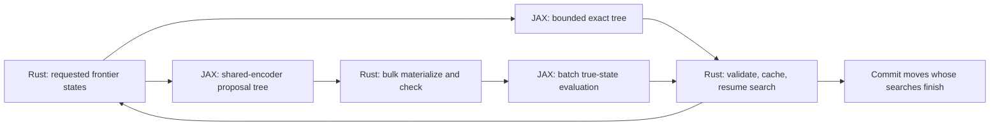

This design extends [DESIGN.md](DESIGN.md) with the requested plain-JAX multi-step execution track. A first untrained policy-only implementation is now CPU-qualified in [dual_trace_probe](research/studies/dual_trace_probe/README.md): both views decode inside one graph, Rust resolves matched continuations, and real action streams match a sequential control. MCTS integration, learned opponent calibration, TPU performance and playing strength remain separate research steps.

The central hypothesis is that a bounded tree of work per CPU–TPU exchange can improve useful self-play throughput when dependent neural requests leave the accelerator underfilled. We should test this before selecting the final architecture. Larger batches across independent games remain the control: they may already hide enough latency that speculative computation loses overall throughput. The objective is stronger play per reserved chip-hour, with synchronization, wasted speculation, and learner capacity all charged.

There are two relevant dependency chains. Within ordinary AlphaZero MCTS, selection traverses already expanded nodes on the CPU, then usually requests one neural evaluation at a new leaf. It does not require a new forward pass at every traversed edge. Across played moves, the next root depends on both players' decisions. A packet can precompute evaluations for either chain, but a useful descendant evaluation is not necessarily a completed future move search.

The user's clarified starting mechanism is **dual autoregressive traces**. At a real position where A is to move, both decoders start from the same observed position/history. Decoder A uses its own policy on A turns and its model of B on B turns; decoder B predicts A first, then uses its own policy on B turns. Each produces `k` sampled traces of `H=2N` plies. Batch the two roles and the samples in one compiled executable, then let Rust determine how many actual decisions are already available. This is the first prototype; explicit branching trees are a later generalization.

For one sample and four plies, the outputs are:

```text
A decoder:  a0       b0_pred   a1       b1_pred
B decoder:  a0_pred  b0        a1_pred  b1
```

The resolver can commit A's legal `a0` immediately. If B's `a0_pred` equals it, B's `b0` was generated under the actual prefix and can be committed. If A's `b0_pred` also equals `b0`, A's `a1` can follow. B's `b1` then requires its predicted prefix through `a1` to match. Agreement on A's final prediction of `b1` is unnecessary if the packet ends there. This is continuation reuse based on the preceding history, not simply the longest common prefix of two complete sequences.

With `k>1`, retain two trace sets and filter by the committed prefix. At each turn, take a continuation from the active player's matching traces according to a predeclared priority independent of their uncommitted suffixes. Commit its next legal own-policy action, extend the prefix, and repeat. Stop when the active player has no matching continuation, a legality check fails, the game terminates, or the horizon ends. Refill from the new actual position. A trie can make matching cheap while preserving model/role/context identities for the associated outputs.

```text
prefix = []
while len(prefix) < H and not terminal:
    player = side_to_move(actual_state)
    eligible = traces[player] whose actions[:len(prefix)] equal prefix
    if eligible is empty: break
    trace = first eligible in fixed priority order
    action = trace.actions[len(prefix)]
    if action is illegal in actual_state: break
    commit(action)
    prefix.append(action)
```

For a sequential autoregressive policy, this can preserve the policy's action distribution if each own-turn token uses that same policy conditioned on the same prefix, masks, model version, and opponent context; sampling randomness is fresh at each position; and continuation selection never inspects future agreement or quality. Filtering on the past then leaves the next own-policy draw intact. This is a proposed invariant to prove and test on small exact policies before using it as a correctness claim for a trained model. Choosing the pair of traces with the longest future agreement violates that invariant: it favors mutually predictable continuations. Training-time dropout, hidden sampled opponent profiles, changed root encodings, or approximate legal masks also require separate treatment if they alter the conditional policy.

The intended JAX layout is a game batch with role and sample axes, logically `[games, 2, k, ...]`, and one `lax.scan` of length `2N` carrying KV caches, action prefixes, PRNG state, and masks. Each iteration appends a token for every active trace. The outputs have shape `[games, 2, k, 2N]`, plus the selected policy/value metadata. Share prompt encoding and the immutable prefix KV logically across samples, then give each branch its own continuation cache; inspect actual allocations rather than assuming broadcast implies physical sharing. Different checkpoints require explicit parameter routing and version tags.

For each player this is `2N*k` generated tokens; across both players it is `4N*k`. The causal depth is still `2N`, with the roles and samples batched in parallel. Fusion removes host dispatches between those decoding steps; it does not eliminate their dependencies or guarantee a single device kernel. Begin with `N=1/2/4` and `k=1/4/16`, screening a few representative combinations rather than a large grid. Record committed plies per packet, generated tokens per committed ply, prefix coverage by depth, and the cost of KV storage, prefill, and decode.

Opponent prediction quality and sampling agreement are different quantities. For independent samples from a player's distribution `p` and its opponent's prediction `q`, one-step agreement is `sum_a p(a)*q(a)`. Even when `q=p`, agreement is only `sum_a p(a)^2`; a diffuse policy can be perfectly calibrated and still match poorly. For a fixed externally specified prefix with probability `r` under a trace generator, `k` independent samples cover it with probability `1-(1-r)^k`. The adaptively resolved path does not automatically satisfy the fixed-prefix assumption, so measure its coverage directly.

A concrete improvement to test is **shared sampling randomness within each pair of decoders**. Use matching random keys for the real player's own-policy draw and the other decoder's prediction of that draw, indexed by game, candidate pair, absolute ply, and canonical action IDs. Identical conditional distributions then produce identical actions under the same sampler, while each own-policy marginal remains unchanged. Keep different candidate pairs independent. Shared categorical uniforms or shared Gumbel noise are implementation candidates; neither guarantees agreement for different distributions. The resolver still may not select by future agreement. This coupling is available in controlled self-play; an external KataGo process does not expose compatible randomness.

There is a strong additional control when both true decisions are cheap policy draws: **joint alternating decoding inside one executable**. At each scan step, sample the active player's actual policy and feed that action into both players' contexts before the next step. It has the same `2N` causal depth as the two independent traces and removes mutual prediction misses. With exact state/mask handling it can advance the entire block. The dual-trace method must justify its extra work through better batching, cheaper opponent predictors, reusable alternative futures, or a setting where the real decision procedure is more expensive than the predictor. Both variants retain the desired coarse CPU–TPU exchange.

Neither construction alone supplies AlphaZero's policy-improvement step. A sampled policy token is not an MCTS decision. First validate execution using declared autoregressive policies. Then use decoded policy/value continuations as speculative evaluator work consumed by ordinary search, or explicitly test an actor with distilled policy decisions and separately budgeted search targets. If searches themselves are completed speculatively, every committed own-turn action must meet its search contract. Keep inference scheduling, the acting policy, and the source of learning targets separately identifiable.

The two-decoder protocol applies directly to self-play because we control both players. Against an external engine, predicted traces provide speculative work; its actual observed action determines which continuation survives. A prediction cannot commit a move on the external engine's behalf. Hypothetical histories may update branch-local opponent beliefs, but only the accepted real prefix updates the persistent belief state.

The implementation will follow the functional structure of the supplied [rig reference trainer](https://github.com/honglu2875/rig/blob/main/recipes/reference/train.py). The inspected code uses explicit parameter dictionaries, functional forward and optimizer updates, `jax.value_and_grad`, explicit mesh/sharding, and compiled updates with donated state buffers. It also imports project helpers; we are adopting these conventions, rather than depending on the rig package or copying its GPT architecture and training schedule.

The proposed runtime consists of Python managed by `uv`, JAX/jaxlib and the compatible TPU runtime, NumPy for host arrays, and our compiled Rust extension. There is no Flax, Optax, or Orbax requirement. Model math and optimizer math use JAX directly. Start with small, auditable SGD/momentum and AdamW implementations; add Muon only for its named ablation, with the exact variant and parameter groups specified. Reference libraries can be isolated numerical test tools without becoming runtime dependencies.

The decoder has **two policy heads and a value head**, with different training targets. Let `h` be a shared encoding of the board and causal move prefix, and `c_opp` a behavioral context inferred from the opponent's observed position/action history:

| Head | Inputs | Target | Purpose |
|---|---|---|---|
| Play policy `p_play` | `h` | The declared MCTS-improved policy distribution | Choose strong moves; distill search improvement |
| Opponent behavior `q_opp` | `h` plus `c_opp`, through a small adapter | The opponent's actual chosen action | Predict that opponent, including characteristic weak moves |
| Value `v` | `h` | Terminal outcome, or a separately declared value target | Evaluate positions under the main game objective |

Both policy heads span the same board-action vocabulary, including pass, and their applicable legality treatment must be explicit. They have separate projection weights and losses. Add opponent identity/strength/style conditioning through the behavioral adapter; the main policy/value heads retain their strong-play targets. Initially stop the behavioral loss's gradient at the shared board representation, allowing the opponent-history encoder and adapter to learn without changing the baseline trunk. Compare joint trunk training afterward, since a shared encoder can otherwise create gradient interference despite separate output heads.

The essential loss terms, with masks and valid-example normalization understood separately, are:

```text
L_play = cross_entropy(MCTS_policy_target, p_play)
L_value = squared_error(terminal_outcome, v)
L_opp = -log q_opp(actual_opponent_action | state_before_action, history_before_action)
L_total = L_play + λ_value * L_value + λ_opp * L_opp + other_declared_auxiliaries
```

Use the full improved policy target for distillation, not merely its argmax. The behavioral label is the move actually played, even when MCTS judges it poor. In particular, do not replace that label with the strong policy, weight it by winning, or apply a reward-maximizing policy gradient to `q_opp`. A bad Go move can be the correct prediction target for a habitual weak opponent. Behavioral examples from cheap turns can be retained in a separate stream without counting them as additional full-search policy targets.

Decoder A therefore alternates `p_play_A, q_A_to_B, p_play_A, q_A_to_B, ...`; decoder B alternates `q_B_to_A, p_play_B, q_B_to_A, p_play_B, ...` from the common A-to-move root. The actual play policy includes its declared temperature and any exploration procedure; the opponent head must learn the resulting observed behavior. If players use different checkpoints, budgets, or policies, preserve those identities. During ordinary zero-sum MCTS, the strong policy guides nodes for both sides in the appropriate perspective. The behavioral head allocates predicted continuations; substituting it for the opponent's search policy would be an explicit experiment in exploiting that opponent.

Train behavioral heads first from our own historical checkpoints and controlled search-budget mixtures. In external KataGo matches the learned weights remain frozen; actual moves update only the declared game-local context/posterior and are not silently added to training replay. A causal decoder can update a hypothetical opponent context along each imagined prefix, but only the accepted prefix becomes real evidence. Report next-action likelihood, calibration, and prefix coverage independently of game strength.

Each cloneable `research/recipes/<id>` owns model initialization/application, optimizer, losses, multi-step algorithm, and the training loop in `train.py` and a few local helpers. The importable library under `packages/gozero` supplies reusable primitives, runtime/transport helpers, checkpoint formats, and provenance. Promoted code lives under `production/recipes/<id>`. A snapshot captures both the recipe and shared source. Parameter and state PyTrees have stable named leaves. Configuration that determines shapes is immutable and captured at compilation; counters, masks, budgets within a bucket, and PRNG keys are array arguments. Functions remain independently callable before compilation. Proposed logical interfaces are:

```text
init_model(key, model_config) -> params, model_state
apply_model(params, model_state, observation, key, mode) -> predictions, model_state
train_step(params, model_state, optimizer_state, batch, key) -> updated_state, metrics
decode_dual_traces(params_by_role, root, observed_context, keys, H, k) -> traces
propose_packet(params, roots, observed_context, packet_budget, key) -> candidate_tree
evaluate_exact_packet(params, exact_roots, histories, packet_budget, key) -> evaluated_tree
```

Implement convolutions, normalization, attention, heads, and losses with `jax.numpy`, `jax.nn`, and `jax.lax`. The Go spatial trunk can attend bidirectionally over the known board; an action-sequence decoder must mask future actions to prevent target leakage. CNNs and transformers share the observation and prediction contracts. Mutable normalization statistics, if an experiment uses them, remain explicit model state; frozen inference never computes batch-dependent training statistics. Keep master parameters and numerically sensitive reductions in fp32, using bf16 for validated dense computation. Explicitly test masks, perspective changes, gradients, optimizer equations, and restore behavior.

Compile outside timed steady-state loops, using explicit input/output sharding and donation only for buffers whose previous contents are no longer needed. An inference snapshot and an in-flight checkpoint must not alias donated learner buffers. Avoid per-step host reads for metrics; accumulate bounded device-side summaries and flush periodically. A short compiled block of learner steps is also measurable, but its collective communication and sample reuse still count. Initially parameters and optimizer state are replicated, so a designated controller can write array payloads plus a JSON tree/dtype manifest, checksums, and a completion marker. Preserve bf16 payloads explicitly and restore optimizer, RNG, replay cursors, and counters. General sharded-model checkpointing is a later capability, not an implicit promise of this minimal format.

One compiled executable can encompass multiple dependent moves only if it has a way to obtain the next representation without asking the CPU after each move. The substantive choices are:

| Execution path | Work inside the compiled graph | Host interaction for a block | Meaning of returned predictions |
|---|---|---|---|
| Exact device transitions | Board transition, history/legality handling, feature construction, and repeated neural evaluation of bounded frontiers | One request/result exchange on a successful block | Ordinary evaluator outputs on actual counterfactual Go states, subject to parity validation |
| Learned proposal, exact verification | Shared root encoder and action-conditioned decoder propose a contingent tree; a later graph evaluates CPU-materialized states | Proposal exchange, one bulk Rust expansion, then one batched evaluator exchange; more work on misses | Descendant proposals are approximate; outputs from the second evaluation are ordinary exact-state outputs |
| Exact rules, incremental neural features | Exact board transitions plus cheaper action-conditioned updates to a shared root representation | One exchange on a successful block, with periodic full reencoding | A new recurrent evaluator on exact states; its outputs are not equivalent to the full evaluator |
| Learned latent search | Action-conditioned latent transitions and prediction heads, optionally selection and backup | One exchange, then Rust legality checks and reanchoring when necessary | Approximate model-based planning predictions; this changes the learning/search method |

The first path directly implements the requested single-executable direction. The second preserves Rust as the only authoritative state-transition implementation and gives us an earlier test of shared computation and coarse exchanges. It takes two coarse exchanges, so we must measure whether it amortizes their cost. The remaining paths change the evaluator/search method. Fully latent dynamics are MuZero-like; checking legality on the CPU does not establish that a latent value or policy equals the true-state evaluator. [MuZero](https://arxiv.org/abs/1911.08265).

Independent heads predicting the move at offsets 1, 2, and 3 are insufficient: they predict future marginals, whereas a tree needs predictions conditional on the particular intervening actions by both players. Our proposal decoder receives the root representation, action prefix, side to move, and causal opponent context. Root encoding can be shared; every branch still needs enough action-conditioned computation to represent its different continuation. Multi-token prediction in language models motivates this amortization, but supplies no Go-specific correctness or speed guarantee. [Multi-token prediction paper](https://arxiv.org/abs/2404.19737).

The most promising model hypothesis to investigate after the execution controls is exact rules with incremental neural features. Encode the root once, advance the actual board in the compiled graph, then condition a smaller recurrent block on the previous latent board, the action, and features of the exact resulting state:

```text
z_0 = encoder(params, features(s_0))
s_next = exact_go_step(s, action, history)
z_next = refine(params, z, features(s_next), action)
(policy_next, value_next) = heads(params, z_next)
```

Here we learn how to update the neural representation, while the exact kernel determines captures and legality. Compare a small spatial refinement block and a cross-attention decoder; measure their actual cost instead of assuming that fewer parameters makes them faster. Reencode periodically and on declared uncertainty/tactical triggers. Train depth-conditioned policy/value heads against real searched positions, with an optional consistency target from our own full encoder on the same exact state. Counterfactual positions can receive exact evaluator targets but cannot inherit the observed game's terminal result. Recurrent outputs depend on their anchor/path and require corresponding cache keys. This hypothesis combines state correctness with shared model computation, but accumulated representation error and repeated reencoding may erase the benefit.

The common integration unit is a bounded packet. Its input is a batch of actual states requested by search, which may be game roots or internal frontier leaves. Rust owns the authoritative games, baseline search, real move commits, and replay. The exact device path mirrors rules for supported compiled buckets. Python dispatches packets and learner batches; no Python board object or per-node callback enters either execution path.



Start the trace interface prototype on 9x9 with `N=2`, `k=4`: two decoders, four plies per trace, four samples per decoder, for 32 generated action tokens per game. Include `N=1`, `k=1` as the smallest control. If traces justify generalizing to explicit trees, compare fixed total-node buckets such as `M=8/32` with the same horizon and compute budget. Batch size is independently tuned within memory and available-game limits. These are engineering starting points, not claimed optima. Neither 32 decoded tokens nor 32 evaluated tree nodes can be credited as four complete 256-evaluation move searches.

Return a flat tree with parent indices, actions, depth, validity/terminal masks, state and feature identifiers, model/evaluator version, and outputs or output handles. Distinguish proposed, materialized, and neural-evaluated nodes. Include counts of actual work, overflow/fallback flags, and the origin of each approximate output. A fixed total node budget prevents exponential materialization: branching factor four through depth four would otherwise require 341 nodes including the root. Allocate extra width near uncertain decisions; a masked packet slot is not a legal move or a training sample.

Within the exact graph, carry fixed-shape boards, metadata, frontier indices, and tree/history references. Use `lax.scan` or bounded loops over expansion rounds, evaluating a batched frontier where possible. `scan` lowers to a loop operation with fixed carry shapes; a single executable is not necessarily a single fused kernel. Serial dependencies remain, weights may still be reread from HBM, and integer-heavy Go rules may use the TPU poorly. Inspect the compiled program and profiler before inferring a reduction in memory traffic. JAX-native MCTS in `mctx` is a useful reference for this style, not a required package or a drop-in rules engine. [JAX scan](https://docs.jax.dev/en/latest/_autosummary/jax.lax.scan.html), [mctx](https://github.com/google-deepmind/mctx).

The device rules contract includes captures, suicide under the selected rules, pass, termination, full positional superko, and correct feature history. Share the historical prefix logically across descendants; carry branch ancestry separately. Keep a root-history snapshot resident when useful and measure its initial transfer and update cost. Fingerprints accelerate history lookup, with exact position checks on matches. A fixed history capacity must flag overflow and fall back to Rust; it must not silently weaken superko. Unsupported sizes also use the generic Rust path. Stock Pgx documents different superko handling and cannot be treated as the strict-rules oracle. [Pgx Go](https://www.sotets.uk/pgx/go/).

In the learned-proposal path, Rust materializes all valid paths in a worker-owned arena, using shared prefixes and apply/undo. Illegal branches and descendants are removed before exact evaluation. The strong evaluator then processes the materialized states in one batch. Root outputs may be reused if they are exactly the same evaluator/input/version; latent descendant outputs are not interchangeable with them. This method can waste work on the wrong branches, but its verified cache entries need not alter the baseline search. Initially compare a cheap proposal based on partial search against a learned shared-encoder decoder so the benefits of speculation and architecture are separable.

Packet outputs can become a bandwidth bottleneck themselves. For 128 roots, 32 nodes per root, and a 19x19 policy, fp32 policy logits alone occupy `128*32*362*4 = 5,931,008` bytes, about 5.66 MiB. Ownership, latent features, and histories add more. Do not return all hidden activations by default. Begin with complete raw policy/value outputs for semantic clarity; compressed logits or device-resident output handles are separate measured optimizations. Fetching handles later can reintroduce the small exchanges we intended to eliminate. Exporting only top-k logits also needs a defined treatment of the omitted policy mass.

Rust integration remains coarse and local. The owning worker imports a packet into its own tree/cache arena and processes ready searches before requesting more work. Batch completion queues use bounded buffers and separated producer/consumer counters; speculative node import must not introduce global tree locks. Keep packet storage on the worker's NUMA node and measure peak resident memory, cache-line transfers, and allocations as well as CPU occupancy. Irregular board updates may remain limited by memory latency. More useful completed work is the goal; compute-bound behavior on both processors is a hypothesis to investigate.

Branch agreement means an actually selected action sequence reaches a cached state with the required rules, input history, model version, and perspective. It does not require access to an external opponent's private search tree. In self-play, both sides can use a common evaluator cache when their model/input contracts match; different checkpoints need separate evaluator keys. A discrepancy discards the invalid continuation for that path, while other correctly keyed evaluations can remain reusable.

There are two levels of reuse, which must stay distinct:

| Reuse level | What can happen immediately | Condition |
|---|---|---|
| Evaluator prefetch | Satisfy a future leaf request from cache and resume ordinary search | The requested full neural input and frozen evaluator match |
| Completed future search | Select and commit one or more actual moves without a new accelerator request | Each reached root has already met its own declared search, exploration, stopping, and move-selection requirements |

A proposal policy or one child value is not a completed search. The first implementation uses evaluator prefetch. Speculatively completing future root searches is a subsequent extension with explicit root statistics, per-root budgets, and reproducible randomness. Even then, future moves cannot be committed before the actual opponent action is known unless both players are the self-play process and their individual decisions have already been resolved.

For a semantics-preserving control, the ordinary search chooses its requests in the same logical order, receives the same frozen evaluator outputs, and records only completed requested evaluations as search work. A prefetched node does not gain a visit or cause a backup just because it was computed. Proposal randomness uses a separate stream from root noise, move sampling, and search tie-breaking. No additional games or terminal labels are created from counterfactual branches. Wall-time-limited search naturally may finish more work; fixed logical budgets are needed to test behavioral equivalence. Floating-point differences between batch shapes can change ties, so verify tolerances and move agreement rather than assuming bit-identical results.

This distinction also limits analogies with speculative decoding. Accepting another model's sampled actions as target-policy actions generally requires a distribution-correcting procedure; agreement alone is not a guarantee for MCTS. The dual-trace resolver instead takes each action from that player's own conditional sampler under the stated invariants. Exact-state evaluator prefetch retains ordinary search by supplying its requested evaluations. Using proposal decisions or latent values directly inside search is a separately identified algorithm. [Speculative decoding](https://proceedings.mlr.press/v202/leviathan23a.html).

The behavioral policy conditions on a mixture of opponent strength and style. The main win/loss evaluator remains the strong-play policy/value model. In self-play, checkpoint identity and configured search budget already provide useful context; unknown-opponent inference is primarily relevant to evaluation and interactive play. Rank-conditioned human prediction is an existing direction in KataGo; our checkpoints do not become calibrated human ranks without the relevant data. [KataGo HumanSL analysis options](https://github.com/lightvector/KataGo/blob/master/docs/Analysis_Engine.md).

Update opponent beliefs from actual observed moves and the state before each move. A concrete initial model is a mixture over a small set of known behavioral profiles. After observing action `a_t`, use a tempered likelihood update with a probability floor and a small pull toward the prior:

```text
w_next[z] ∝ ((1 - λ) * w[z] + λ * prior[z])
            * max(q_z(a_t | s_t, observed_history_before_t), ε)^β
```

Tune `λ`, `ε`, and `β` against held-out sequential prediction, with log loss, calibration, and branch coverage reported. Keep uncertainty after a small number of moves, and test changed opponents and search budgets. Simulated moves can condition a hypothetical continuation, but never count as new evidence about the real opponent. Strength is not a complete model of style; the mixture should be judged by predictive performance rather than its labels.

Use the predicted opponent distribution to allocate speculative branches, mixed with coverage from the strong policy and a small exploration allocation. This can improve cache usefulness without making the player depend on an anticipated opponent mistake. An exploitative search that changes backups or selects moves on the assumption of weak responses changes the objective and requires a separate robust-opponent evaluation. The default champion retains the ordinary zero-sum objective. Cached ordinary evaluator outputs are independent of the behavioral posterior; opponent-conditioned proposal or value outputs need their own context/version keys.

The shared-encoder proposal model is trained first on causal future action sequences from completed real games, including both players. Supervision may also use exact evaluator outputs on materialized speculative states, but those are explicitly charged distillation targets, not independent game outcomes. Counterfactual branches require exact state materialization before assigning state-based targets. Prevent future moves or game outcomes from entering the opponent context supplied as input. If latent outputs are eventually used directly for search, add action-conditioned dynamics/prediction objectives and reanchoring tests; prioritize tactical captures, ko, ladders, and long sequences where model error can compound.

There is directly relevant prior work to beat: *Speculative Monte-Carlo Tree Search* (NeurIPS 2024) pipelines searches for predicted future moves and caches evaluations from speculative work. Its GPU experiments support testing this direction, but do not establish the gain on our TPU system. In particular, part of its 19x19 training-time comparison is extrapolated across differing training settings. Include an ordinary inference-cache control and a partial-search speculation control, so cache gains are not attributed entirely to multi-step modeling. [Paper and methods](https://papers.nips.cc/paper_files/paper/2024/file/a19940b01b77b6acd41ff8b32b334e7c-Paper-Conference.pdf).

Two simple quantities help interpret the experiment. If a packet supplies `U` evaluations that ordinary search actually requests, a first serial approximation is `speedup ≈ E[U] * ordinary_query_time / packet_time`. Packet time includes proposal work, state transitions, all neural evaluations, transfers, imports, and allocated fallback work. Wasted branches count even if their outputs are never read. For an asynchronous system, measure the critical path and aggregate game throughput instead of adding overlapped stage timings.

For actual move-prefix coverage, let `c_j` be the conditional probability that the observed action at depth `j` remains covered, given the prefix so far. Expected covered plies through horizon `H` are `Σ(k=1..H) Π(j=1..k) c_j`. With an illustrative constant coverage of 0.8, horizon four covers 2.36 plies on average and the full four-ply prefix only 41% of the time; horizon eight covers 3.33 plies on average. These are coverage arithmetic, not completed-search or throughput predictions. Branching and compute costs can grow much faster. Early random self-play may favor `H=1`, while later predictable positions may justify longer packets.

The experimental sequence is bounded and feeds the main design's existing compute ledger:

| Stage | Comparison | Decision |
|---|---|---|
| Trace the baseline | Rust asynchronous batching; sweep live games, workers, and real model batch sizes | Establish whether transfer/dispatch waits, CPU work, or neural capacity limits useful throughput |
| Validate dual decoding | Sequential policy execution; joint alternating scan; dual traces with independent or paired randomness | Verify resolver behavior/distributions and compare committed plies per total decode cost |
| Isolate speculation | Baseline with cache vs partial-search prefetch, at identical model and logical search settings | Quantify useful hits, wasted evaluations, and completed-game gains |
| Compare packet execution | Exact device blocks vs learned proposals plus bulk Rust and exact evaluation | Find whether fewer exchanges repay device rules or proposal/verification cost |
| Test opponent context | Fixed strong-policy proposals vs known profile vs inferred profile | Improve held-out coverage/calibration without changing baseline search quality |
| Confirm learning | Promising execution method in small 9x9 from-scratch runs, then early 19x19 checks | Improve fresh eligible rows and strength per total compute across seeds |
| Model/search change | Exact-state incremental neural features; direct latent search or completed speculative future searches as later controls | Demonstrate strength gains with model error, reencoding, and additional search work included |

Use frozen early/middle/late model checkpoints, representative opening/capture/ko/late-game positions, and realistic independent-game batches. Measure CPU selection/advance/backup time, queue waits, H2D/D2H bytes and duration, device execution, host synchronizations, p50/p95/p99 latency, packet fill, useful-cache hit rate, valid and discarded branches, fallback rate, CPU/TPU memory, and total model/proposal FLOPs. Report logical requested evaluations separately from every neural computation actually executed, and packet reuse separately from ordinary cache reuse. A trace using future-known actions is an explicitly labeled upper bound, never a candidate algorithm.

A provisional systems promotion threshold is at least a 20% improvement in completed useful self-play throughput over the tuned batching-plus-cache control on the same allocation, with fixed-budget search equivalence established for the exact-prefetch mode. For changed search algorithms, require independent game-strength evidence rather than an equivalence claim. A faster isolated actor benchmark is insufficient if it starves the learner or reduces data quality. Compare strength at fixed logical search budgets and at fixed total wall time, then use reserved chip-hours to select the training recipe.

M2 gains the trace/packet interface, resolver checks with small exact policies, baseline profiling, a partial-search prefetch control, and a bounded exact-device feasibility prototype. Trained decoders and opponent heads require M3 data; schedule their experiments immediately after the first learning loop. Cap initial post-bring-up experiments on this track at 10% of the calibration-plus-ablation compute allowance, revising within that allowance only after a measured positive result. Charge all reserved pod time during development as well. We retain a working Rust search/learner path while testing these alternatives, so a disappointing speculative hit rate does not block a complete training run.

The proposed first decision is therefore to build plain-JAX functional models and a Rust boundary that accepts the user's dual traces, test the resolver and the joint-decoding control, and compare exact and proposal/verification execution before a broad architecture sweep. The protocol makes the multi-step hypothesis concrete while measuring whether longer graphs and reused continuations yield better Go learning.
