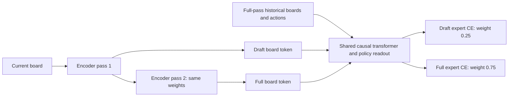

This recipe tests a first-pass auxiliary expert-policy objective. The selected
parent is the four-attention encoder with context readout: 231,181,121
parameters and 37.428122 GFLOPs per full cached move. Both paired seeds
passed the explicitly adaptive quality-only replication; the original
latency-screen failure remains recorded. The parent is selected for
research, without a production or MFU claim. Each configuration pins its
matching trained parent audit.

The total loss is 0.75 full-policy CE + 0.25 first-pass CE on the same target,
legal mask and live positions. The encoder, connector, temporal transformer
and policy readout share parameters. The first encoder pass is computed
once and reused by the full second pass and the draft connector. No batch
statistics, behavior objective, value target or separate draft weights are
introduced. All parameters and the full-policy inference graph remain in
the established budget; additional training work is counted separately.

The draft sees fully processed historical boards/actions, plus one encoder
pass of the current board. Training packs [draft board, full board, action]
frames with an explicit attention mask. Draft keys are never historical
keys. The current draft can see its own key but cannot see the current full
board or action. The full-board/action paths cannot see any draft keys.
Both board variants use the same logical RoPE position; the action is next.
The inference cache still stores one board token and one action per move.
A draft cache result must not replace the full-history cache without separate
verification/recomputation. Multi-step speculative acceptance is not tested
by this learnability experiment.

The connector is shared between both board tokens. The explicit mask keeps
the current full board hidden from the draft and keeps every draft token
out of historical keys; the diagram represents shared computation paths,
not independent transformer weights.

`test_draft.py` verifies the exact mask, full-history cached equivalence,
absence of leakage, shared-pass reuse, preserved main-policy gradients and
the single teacher target. `training_arithmetic.py` independently enumerates
active masked Splash tiles and verifies the forward/dQ/dKV schedules and
kernel-body matrices. All complete encoder, connector, head, backward and
rematerialization work is counted, including padded training attention.

Every auxiliary TPU attempt checks Splash outputs and Q/K/V gradients against
transparent attention at all three real training lengths. Both initialization
and trained weights compare masked full/draft outputs with ordinary full
inference and one-pass append on full-history caches at batch 128 and 128
past moves. Full and draft warm decoding are timed with donated, observed
caches. The final draft and the paired parent’s unsupervised first-pass draft are
evaluated on the same complete validation set as the main policy. Record
teacher KL, legal-policy distribution overlap with each model’s full policy,
and greedy agreement. The overlap is a teacher-forced one-step statistic;
it is not a measured multi-step acceptance rate. The test split stays closed;
qualification uses a small held-out subset, while full learning uses all
1,170 validation games.

The primary replication screen requires >=1% full-policy endpoint KL reduction
and <=15% initial full-decode slowdown. A separately registered exploratory
draft-utility screen requires <=1% full-policy KL regression, <=15% initial
full-decode slowdown, >=5% draft KL reduction versus the matched parent's
unsupervised draft, >=0.02 absolute improvement in full/draft probability
overlap, and trained draft/full latency <=0.65. Either screen triggers a
second paired seed; each scientific conclusion must pass its own criterion
on both seeds. Passing only the draft screen does not promote a weaker full
policy as an architecture improvement. See the prospective
`research/studies/spatial_followups/auxiliary_contract_001.json`.

Draft quality, draft latency and extra training time are reported separately.
Agreement or probability overlap would not establish
multi-step acceptance, MCTS equivalence, Go strength or improved RL scaling.
