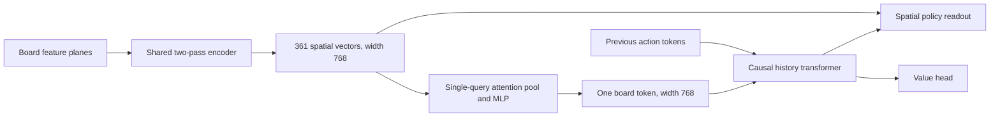

# Attention pooling for a single board token

The current study replaces only the board-token connector of the selected
19x19 transformer. Training has been launched; results are pending. Follow
[sequence-001/attention-current.json](sequence-001/attention-current.json), then
[sequence-001/flat-current.json](sequence-001/flat-current.json). The unattended
controller publishes [sequence-001/result.json](sequence-001/result.json),
`RESULTS.md`, and `curves.csv` after both audited stages complete, or a failure
record if the queue stops. A separate CPU postprocessor then renders
`curves.png` and `curves.pdf`; its status is `plot-completion-001.json`.

| | Flat connector | Learned attention pool |
| --- | ---: | ---: |
| Whole model parameters | 232,011,540 | 232,023,236 |
| Encoder parameters, including connector | 118,161,424 | 118,173,120 |
| Replaced connector parameters | 4,449,040 | 4,460,736 |
| Encoder matrix FLOPs per board, including both passes | 167.057475 GF | 167.061886 GF |
| Temporal width / layers | 768 / 18 | 768 / 18 |
| Temporal tokens per board | 1 | 1 |

The query attends to the 361 spatial features using 12 heads and feeds a residual
768→1728→768 MLP. The spatial policy bypass still uses all 361 feature locations.

The complete decoding matrix-FLOP difference is approximately **+0.0026%**;
parameter difference is **+0.0050%**. These analytical counts exclude elementwise
operations and cache traffic; they do not establish equal latency or MFU.

Both fresh runs use the same fixed data, game draws, augmentation, optimizer,
losses and validation population. Each stage has 256 updates / **13,724,466
training-position exposures**, with a fixed 512-update optimizer schedule so the
exact checkpoints can continue later. The sequence is attention, then control,
using the whole pod for each. Estimate: roughly ten hours for the pair, subject
to measured candidate throughput and compilation.

See the [preregistered protocol](PROTOCOL.md), [budget](budget-001.json),
[registration](registration-001.json), and importable [recipe](../../recipes/strong19_attention_pool).

Qualification evidence:

- [CPU numerical, gradients, causal masking and optimizer continuation](cpu-qualification-002.json).
- [Packed training, full-history inference and cached decoding](decode-qualification-001.json).
- [Real trainer: uninterrupted versus fresh-process save/restart](harness-qualification-001.json).
  All parameter/moment arrays, sampler state, update metrics and validation
  histories match exactly for both small-model arms on four simulated devices.
- [Midpoint all-state auditor](stage-audit-qualification-001.json).
- [First two full-size TPU updates](startup-qualification-001.json): accepted
  and finite on all four ranks, identical common metrics, exact registered draws.
  Observed update times were 62.17 seconds (512) and 83.50 seconds (768); these
  are startup observations, not a repeated performance benchmark.

The CPU development failure is retained in `cpu-qualification-001.json`; it
concerned an unsupported BF16 batched-dot layout, resolved with equivalent
per-head GEMMs. There is no architecture-quality result yet. One paired seed and
a midpoint endpoint are insufficient for a strength or production promotion.

The controller validates every 16 updates, records train/validation overfit
flags, watches resources and stalls, audits all rank/checkpoint state, and makes
a verified peer RAM copy of each endpoint. Checkpoints are volatile and need
durable promotion before long-term use. Dataset and prior critical checkpoints
are retained; no bulk cleanup or data generation is part of this experiment.
