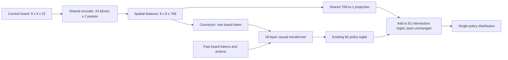

The LR follow-up and minimal spatial-readout experiment are complete, including a fresh paired second seed. The spatial correction's improvement repeated in both seeds. Four full 1,024-update runs and one full-shape qualification passed their audits.

Increasing the one-token control's peak AdamW LR from 6e-4 to 1e-3 reduced first-seed validation KL from 0.564571 to 0.533315 (5.54%). LR 1e-3 is the best of the three tested rates at this horizon; both spatial pairs use it. No larger LR or longer-horizon optimum is established.

| Seed | Position exposures per arm | Control KL | Spatial KL | Relative KL reduction | Initial decode ratio |
|---|---:|---:|---:|---:|---:|
| 91312427 | 11,469,333 | 0.533315 | 0.513489 | 3.72% | 1.019 |
| 91312428 | 11,658,533 | 0.527184 | 0.506703 | 3.89% | 1.041 |

Mean endpoint KL is 0.530250 for control and 0.510096 for spatial, a 3.80% relative reduction. Direction replicated: True. Both pairs satisfy the exploratory threshold of at least 1% KL improvement and no more than 15% initial decode latency regression: True. Two seeds support reporting repeatability of direction, not precise statistical confidence. Both results are retained regardless of outcome.

*Figure omitted from the source export: Both paired seeds. Recreate it with the study plotting script.*

The only model intervention adds `F[i] @ w + b` to each intersection logit, using the final encoder feature map F of shape 9x9x768. The same weight [768,1] and scalar bias are shared across all intersections and start at zero. Pass is unchanged. This adds 769 parameters and 124,416 multiply-add FLOPs per move, reuses the existing feature map, and retains one policy distribution and one training objective. There is no behavior or value objective. Common initial arrays and initial policies match within each pair; optimizer, data and D4 draws match exactly.

The original encoder and temporal network remain unchanged: a stride-one 3x3, 22-to-768 stem; 24 unique residual blocks executed twice; then channel compression 768-to-64 and a flattened 5184-to-768 projection producing one historical board token. Each encoder block has depthwise 3x3 convolution, LayerNorm, pointwise 768-to-3072, GELU, pointwise 3072-to-768, and learned channel scaling initialized at 1e-6. The 18-layer causal temporal transformer has width 768, 12 query heads, four KV heads, head width 64, SwiGLU width 2048, RMSNorm and RoPE. An observation token predicts its action before that action is visible. Everything is plain JAX and batch-normalization-free.

The spatial model has 231,119,681 parameters: 117,780,544 encoder/connector, 113,273,856 temporal, and 65,281 other input/readout parameters. Complete cached decoding is 37.267765 GFLOPs per move at 9x9, batch 128 and 128 prior moves, versus 37.348256 for the frozen CNN. Parameter, dense-FLOP and unit-cost floating-operation differences all stay within 1%. Training/rematerialization arithmetic is recorded separately. Equal decoding arithmetic does not imply equal training work or equal hardware utilization.

The historical comparison uses the first seed and identical actual samples, while retaining each architecture's previously selected LR:

| Model | Parameters | Peak LR | Final KL | Top-1 | Learning minutes | Initial warm decode ms |
|---|---:|---:|---:|---:|---:|---:|
| CNN | 232,431,872 | 1e-03 | 0.420361 | 0.6666 | 31.98 | 16.26 |
| C128 encoder transformer | 234,281,728 | 3e-04 | 0.521731 | 0.6268 | 43.62 | 81.96 |
| Six-layer encoder transformer | 232,551,168 | 3e-04 | 0.511634 | 0.6289 | 40.44 | 72.58 |
| One-token control | 231,118,912 | 1e-03 | 0.533315 | 0.6228 | 20.22 | 8.73 |
| Spatial readout | 231,119,681 | 1e-03 | 0.513489 | 0.6293 | 20.22 | 8.90 |

The spatial result is close to the six-layer encoder's endpoint, with 2.00x faster execution of the same training schedule and 8.16x faster initial warm decoding. It remains 22.2% worse than the CNN in final KL. The CNN already reaches 0.509361 at update 512 after 16.18 learning minutes, so this round does not establish better accuracy per training minute than CNN.

*Figure omitted from the source export: Historical context by updates and learning time. Recreate it with the study plotting script.*

The CNN is the existing KataGo-derived nested CNN with its BN-free FSON/Mish implementation and training helper retained. This table compares main-policy KL; it is not a new exact reproduction of KataGo training. Initial decode timing is used for historical consistency. Trained-weight decode medians are included in the paired evidence. Warm neural timings include the encoder and pending action but exclude CPU rules/features, transfers and pointer reset; they are not complete rollout throughput or MFU. Learning minutes exclude compilation, evaluation and checkpoint writing.

Endpoint effects by game phase, computed over the same full validation population in each pair:

| Moves, zero-based | Validation positions | Spatial minus control KL, seed 1 | Spatial minus control KL, seed 2 |
|---|---:|---:|---:|
| [0, 16) | 18,720 | +0.002160 | -0.001829 |
| [16, 64) | 53,317 | -0.031159 | -0.032982 |
| [64, 128) | 21,994 | -0.014476 | -0.010839 |
| [128, 256) | 8,211 | -0.010911 | -0.007474 |
| [256, 2048) | 97 | -0.001410 | -0.036915 |

The late tail has only 97 positions and is not a reliable basis for selecting an architecture. A successful spatial bypass supports retaining this readout as a research candidate. It does not isolate whether channel compression, one-token projection or temporal processing is the limiting stage, or separate spatial information from the correction's effect on pass calibration.

A separate read-only CPU diagnostic compared one versus two encoder passes on the current board, preserving the exact two-pass history cache at 64 prior moves. The same eight validation positions were used for both trained first-seed models:

| Model | Greedy agreement with two passes | Mean probability overlap | One-pass teacher KL | Two-pass teacher KL |
|---|---:|---:|---:|---:|
| Control | 75.0% | 85.8% | 1.1361 | 1.1156 |
| Spatial | 37.5% | 82.7% | 0.9014 | 0.9306 |

This is an eight-position compatibility diagnostic, not full validation, a draft-model training experiment, measured multi-step acceptance, MCTS equivalence or a TPU speed test. It motivates training an early-exit objective before claiming that dropping a pass provides a useful speculative draft.

Training uses the same fixed weak native-MCTS teacher dataset as earlier studies, not KataGo expert labels or architecture-specific self-play. There are 9,466 training games / 836,486 positions and 1,170 validation games / 102,339 positions; the test split remains closed. Each update draws 128 complete games across four hosts. AdamW uses beta=(0.9,0.95), epsilon=1e-8, weight decay 0.01, clipping at 1, 64 warmup updates and cosine decay to 0.3 of peak LR. Initialization and sample sequences differ across seeds; each pair shares its actual draws and common initial weights. There is no playing-strength, convergence or RL-improvement claim.

Nine CPU tests passed, covering causal and cached execution, nonzero spatial corrections, inactive/stale cache guards, shared/rematerialized gradients, zero-initialized equivalence and location/pass behavior. Full-shape TPU qualification covered global batch 128 and all 128/256/384 training buckets. Every full run passed finite-update, exact-sample, replica, persistent-checkpoint and trained-cache audits. Negative audit checks rejected a mislabeled LR contrast and a repeated seed presented as replication.

The five TPU attempts used 27.971 recorded attempt chip-hours, including launch/compile/checkpoint overhead. All four new full checkpoints are retained on persistent storage. Qualification arrays have two hash-verified persistent remote replicas, with a restore receipt and locator; temporary RAM was used only for validation. Previous immutable study artifacts are preserved. This round is closed and no further TPU job is queued.

The next architecture candidate is spatial attention inside the encoder before compression, retaining one historical board token and the local readout. A four-token connector is a separate alternative. Both have only analytic budget proposals so far: full graph FLOPs, padding, memory, causality and runtime must be qualified before either is trained. Neither proposal nor early-exit/speculative training was silently added to this round.

Implementation: [cloneable recipe](../../recipes/single_board_spatial/README.md). Evidence: study index (external or omitted experiment artifact), paired replication (external or omitted experiment artifact), historical comparison (external or omitted experiment artifact), LR selection (external or omitted experiment artifact), spatial-attention proposal (external or omitted experiment artifact), four-token proposal (external or omitted experiment artifact). Regenerate with `.venv/bin/python -B research/studies/visual_katago/shared_spatial_report_20260913.py`.
